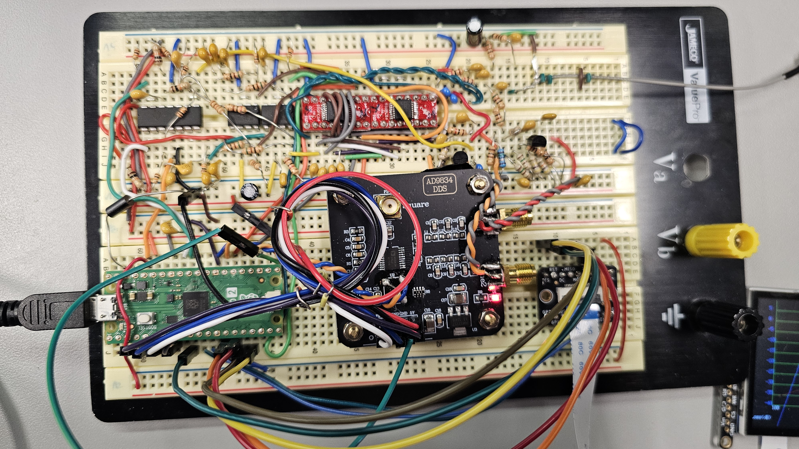
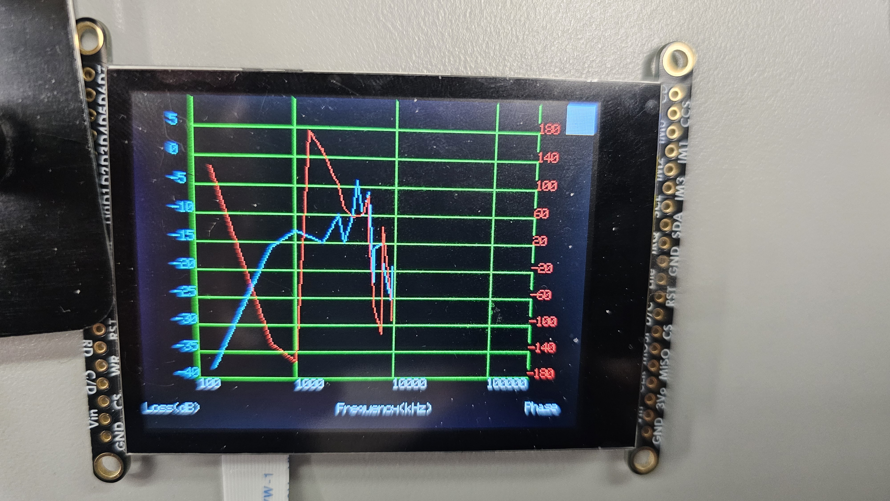

# Super VNA

This is a 10MHz, 1-port VNA, built on a breadboard.  
Our design utilizes a Tayloe detector to downconvert the received reflected signal, which is different from conventional VNAs and can be much cheaper in construction. Additionally, we replace the conventionally used directional coupler with a wheatstone resistive bridge, which has been done before in the NanoVNA (a commercially-available hobbyist-grade VNA).

A schematic is available [here](./hardware/SuperVNA/schematic_sheets.pdf).

## Usage

Calibration occurs each time the device is power-cycled.  
Tap anywhere on the touchscreen once the requested standard is connected.  

Afterwards, a white square appears in the upper-right-hand corner of the screen. This button switches between the graph and menu views.  
In the graph view, the graph continuously updates as the device does each sweep.
In the menu view, the insertion loss and phase traces can be turned on and off, and the number of pixels-per-decade ("PPD") can be adjusted to change the graph scaling.

A picture of the device on the breadboard:

